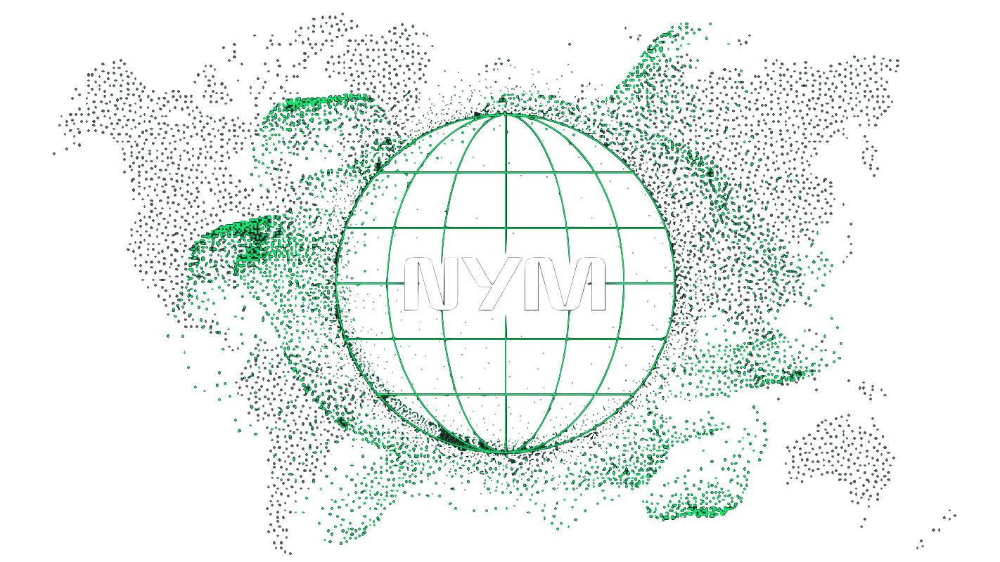

<div align="center">




</div>

# Nym Transport Bridges

This repository implements and provides tooling for a pluggable transport system used to secure and
obfuscate [Nym VPN](https://github.com/nymtech/nym-vpn-client/) traffic. The
[nym-bridge](./nym-bridge/) is a server-side transparent forwarder accepting and unwrapping
obfuscated traffic to be passed on to a colocated [nym-node](https://github.com/nymtech/nym) entry
gateway.

The larger Nym system provides a secure distributed multi-hop VPN and mixnet.

<div align="center">

⚠️⚠️  This repository is under active development and encodings, serialization formats, interfaces,
etc. are subject to change  ⚠️⚠️
</div>

## Usage

#### Build


The nym-bridge binary runs the server side listener for the transports defined by the bridge
configuration. The binary can be built using:

```sh
cargo build --release -p nym-bridge -p bridge-cfg

# sudo cp target/release/nym-bridge /usr/local/bin/
```

#### Automatic Configuration

The [`bridge-cfg`](../bridge-cfg/) tool is provided to assist with key generation and configuration
management -- for more details on automatic configuration see
[`bridge-cfg/README.md`](../bridge-cfg/README.md).

This tool assumes that the `nym-bridge` is going to be run alongside a `nym-node`

```sh
# Try a dry run to preview the configuration changes
bridge-cfg -d "$HOME/.nym/nym-nodes/default-nym-node/config/" --dry-run

# Allow configuration changes to be persisted
bridge-cfg -d "$HOME/.nym/nym-nodes/default-nym-node/config/"
```

Manual configuration instructions can be found in [`nym-bridge/README.md`](./nym-bridge/README.md)

#### Usage

```sh
$ nym-bridge -h
Usage: nym-bridge [OPTIONS]

Options:
  -c, --config <CONFIG_PATH>  Provide a path to the configuration for launching server listeners [default: /etc/nym/default-nym-node/bridges.toml]
  -h, --help                  Print help

$ nym-bridge -c "<path_to_bridge_config>"
```

## Protocols

#### Quic

QUIC is a UDP-based, stream-multiplexing, connection-oriented, encrypted transport protocol that creates a stateful interaction between a client and server. The protocol published as [RFC 9000](https://www.rfc-editor.org/rfc/rfc9000.html).

This tool uses ed25519 keys to sign certificates for the TLS handshake used by Quic. The public (verifying) key is shared to clients as part of the node description and can be used to verify the server identity and secure a Quic TLS connection.

**TLS over TCP**

TLS over TCP is the most common protocol used across the public internet. It provides a connection-oriented, encrypted transport protocol.

This tool uses ed25519 keys to sign certificates for the TLS handshake. The public (verifying) key is shared to clients as part of the node description and can be used to verify the server identity and secure a TLS connection.

**[Future]** Shadowsocks | ssh | obfs4 | vmess | webrtc | ...


## Testing

A minimal docker test environment is provided for testing the tunneling and connection handling of
the nym-bridge binaries. The [`bridge-tools`](./bridge-tools/) are intended for use in this
environment.

See [`./test-env/`](./test-env/) for more details. 
