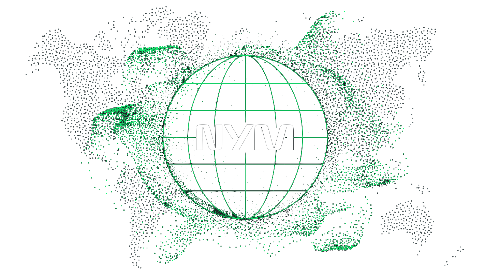

<div align="center">




</div>

# Nym Transport Bridges

<p>
  <a href="https://github.com/nymtech/nym-bridges/actions/workflows/rust.yml">
    </a>
  <a href='https://coveralls.io/github/nymtech/nym-bridges?branch=main'></a>
</p>

This repository implements and provides tooling for a pluggable transport system used to secure and
obfuscate [Nym VPN](https://github.com/nymtech/nym-vpn-client/) traffic. The
[nym-bridge](./crates/nym-bridge/) is a server-side transparent forwarder accepting and unwrapping
obfuscated traffic to be passed on to a colocated [nym-node](https://github.com/nymtech/nym) entry
gateway. The larger Nym system provides a secure distributed multi-hop VPN and mixnet.

| Crate | crates.io | docs.rs | dependencies |
| :--- | --- | --- | ---
| [nym-bridges](./crates/nym-bridges/) |  [](https://crates.io/crates/nym-bridges) | [](https://docs.rs/nym-bridges) | [](https://deps.rs/crate/nym-bridges/latest) |
| [nym-bridges-types](./crates/nym-bridges-types/)  | [](https://crates.io/crates/nym-bridges-types) | [](https://docs.rs/nym-bridges-types)  | [](https://deps.rs/crate/nym-bridges-types/latest) |


<div align="center">

⚠️⚠️  This repository is under active development ⚠️⚠️
</br>Encodings, serialization formats, interfaces,
etc. are subject to change  
</div>

## Usage

#### Build


The nym-bridge binary runs the server side listener for the transports defined by the bridge
configuration. The binary can be built using:

```sh
cargo build --release -p nym-bridge -p bridge-cfg

# sudo cp target/release/nym-bridge /usr/local/bin/
```

#### Automatic Configuration

The [`bridge-cfg`](./crates/bridge-cfg/) tool is provided to assist with key generation and configuration
management -- for more details on automatic configuration see
[`crates/bridge-cfg/README.md`](./crates/bridge-cfg/README.md).

This tool assumes that the `nym-bridge` is going to be run alongside a `nym-node`, but attempts to configure expected defaults if a nym-node config is not present.

```sh
# Try a dry run to preview the configuration changes / file locations
bridge-cfg --gen --dry-run

# Allow configuration changes to be persisted
bridge-cfg --gen
```

**Security Note:** After generating your bridge configuration, ensure proper file permissions to protect sensitive key material:

```sh
# Restrict config file to owner only (recommended for production)
sudo chmod 600 /etc/nym/bridges.toml

# Protect keys directory
sudo chmod 700 /etc/nym/keys
sudo chmod 600 /etc/nym/keys/*
```

**Refreshing Configuration:** If your server's public IPs change after initial setup, you can refresh the configuration:

```sh
# Re-detect public IPs while preserving existing keys
bridge-cfg --gen -i /etc/nym/bridges.toml -o /etc/nym/bridges.toml
```

Manual configuration instructions can be found in [`crates/nym-bridge/README.md`](./crates/nym-bridge/README.md)

#### Usage

```sh
$ nym-bridge -h
Usage: nym-bridge [OPTIONS]

Options:
  -c, --config <CONFIG_PATH>  Provide a path to the configuration for launching server listeners [default: /etc/nym/default-nym-node/bridges.toml]
  -h, --help                  Print help

$ nym-bridge -c "<path_to_bridge_config>"
```

## Protocols

**NOTE:** The current transports assume that the next layer of the transport session is responsible for user authentications. Specifically in production these transport act as a transparent wrapper for wireguard traffic where wireguard is responsible for the ultimate authorization check. The initial defined protocol `quic_plain`, `tls_plain`, and `ssh_plain` are meant to resist protocol fingerprinting specifically and do not address challenges like active-probe resistance.

#### Quic

QUIC is a UDP-based, stream-multiplexing, connection-oriented, encrypted transport protocol that creates a stateful interaction between a client and server. The protocol published as [RFC 9000](https://www.rfc-editor.org/rfc/rfc9000.html).

This tool uses ed25519 keys to sign certificates for the TLS handshake used by Quic. The public (verifying) key is shared to clients as part of the node description and can be used to verify the server identity and secure a Quic TLS connection.

**TLS over TCP**

TLS over TCP is the most common protocol used across the public internet. It provides a connection-oriented, encrypted transport protocol.

This tool uses ed25519 keys to sign certificates for the TLS handshake. The public (verifying) key is shared to clients as part of the node description and can be used to verify the server identity and secure a TLS connection.

**SSH over TCP**

SSH over TCP piggybacks on a protocol that is extremely common on the public internet and blends in with ordinary administrative traffic. It provides a connection-oriented, encrypted transport secured by a Diffie-Hellman key exchange.

This tool uses the same ed25519 identity key as the other transports as the server's SSH host key. The public (verifying) key is shared to clients as part of the node description and is pinned by the client to verify the server's identity during the key exchange, rather than trusting whatever host key is presented.

Authentication uses SSH's `none` method purely as a shared username check between client and server (configurable, defaulting to `ubuntu`) rather than as a real multi-user credential. Once authenticated, the connection is restricted to a single, opaque data channel used to carry forwarded traffic: shell access, command execution, subsystems, pseudo-terminals, X11 forwarding, and TCP/IP port forwarding are all explicitly rejected, so the transport cannot be used as a general-purpose SSH server.

**[Future]** Shadowsocks | obfs4 | vmess | webrtc | ...

## Testing

A minimal docker test environment is provided for testing the tunneling and connection handling of
the nym-bridge binaries. The [`bridge-tools`](./crates/bridge-tools/) are intended for use in this
environment.

See [`./test-env/`](./test-env/) for more details. 
