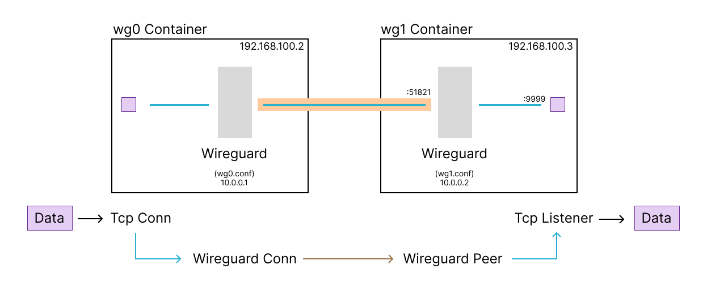
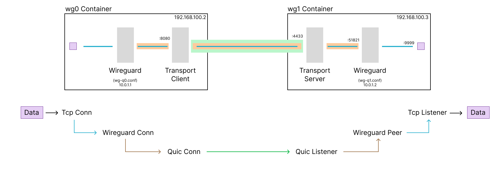

This env sets up two containers that can communicate with each other using a wireguard connection.

This is intended to help test wireguard over a transport. 


stand up the environment

```sh
docker compose up --build
```

This will build and start the containers. 


connect to the `wg0` container -- a similar command can be used to connect to the `wg1` container

```sh
docker exec -it wg0  bash
bash@1234567890$ 

```


Within the container we can ping, try connections, capture packets etc.

```sh
# capture packets on the containers main interface
tcpdump -i eth0 -n -v


# capture packets on the wireguard interface within the container
tcpdump -i wg0 -n -v
```


---

## TCP listen and connect over wireguard



```sh
# wg0

# listen on tcp port 9999
nc -lv 9999
```


```sh
# wg1

# connect over wireguard to the tcp listener
nc 10.0.0.1 9999
```

---

## TCP over Wireguard over Quic



```sh
# in wg1 container -- listen on tcp:9999 for incoming test connection
nc -lv 9999


# in wg1 container -- run the server side of the connection forwarder
#
# this uses the default configuration file for the docker env in 
# `test-env/test-config/server.toml` mapped in to `/etc/nym/transport/server.toml`
nym-bridge -c /etc/nym/default-nym-node/server.toml

# in wg0 container -- run the client capable of connecting to the server
#
# alternatively the forwarding client using TLS can be run using the following.
# note, based on config this binds the same port as the quic config so one of them
# must be modified if they are to be run at the same time.
client-udp --config /etc/nym/default_nym_node/client_quic.toml
client-udp --config /etc/nym/default_nym_node/client_tls.toml

# in wg0 container -- open a tcp connection to kick off the layered wrapped tunnel to the netcat tcp listener on the server
nc -vvv 10.0.1.2 9999
```
